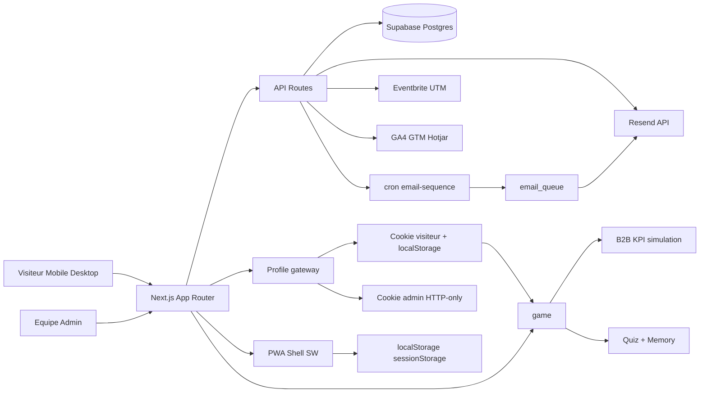

# Architecture Technique

## Vue d'ensemble

La plateforme est construite en **monolithe modulaire Next.js 14** (App Router) avec des APIs serverless internes.

- Front office: landing B2B/B2C + PWA visiteurs immersive + hub profil
- Back office: admin modules + dashboard analytics
- Data: Supabase PostgreSQL (fallback mémoire si non configuré)
- Integrations: Eventbrite, Resend, GA4/GTM/Hotjar

## Schéma d'architecture (Mermaid)

## Couches logiques

1. UI Layer (`/app`, `/components`)
- Rendering pages App Router
- Composants presentationnels et interactifs

2. Application Layer (`/hooks`, `/services`)
- Orchestration use-cases (booking, leads, modules, analytics, emails)
- Gestion etat client (profil visiteur, PWA, UTM)

3. Domain/Validation Layer (`/types`, `/lib/validators.ts`)
- Types TypeScript stricts
- Schemas Zod

4. Integration Layer (`/lib`, `/services`)
- Builders URL Eventbrite + UTM
- Envoi email Resend
- Connexion Supabase
- Tracking analytics

## Choix d'architecture

- **Monolithe modulaire**: vitesse de livraison, cout infra minimal, maintenance simplifiee
- **Serverless API routes**: scalable sans ops lourde
- **PWA offline-first partiel**: experience robuste sur smartphone pendant la visite
- **BFF pattern implicite**: Next.js fait front + backend de proxie/metier
- **Profile gateway**: point d'entree unique pour session visiteur et session admin

## Points d'attention production

- Ajouter RLS + policies Supabase
- Configurer rate-limit sur endpoints publics (`/api/subscribe`, `/api/leads`)
- Centraliser logs (Vercel + Sentry optionnel)
- Verifier SLA Eventbrite/Resend et plan de fallback
- Considerer un stockage serveur des sessions visiteurs si besoin de reporting nominal
